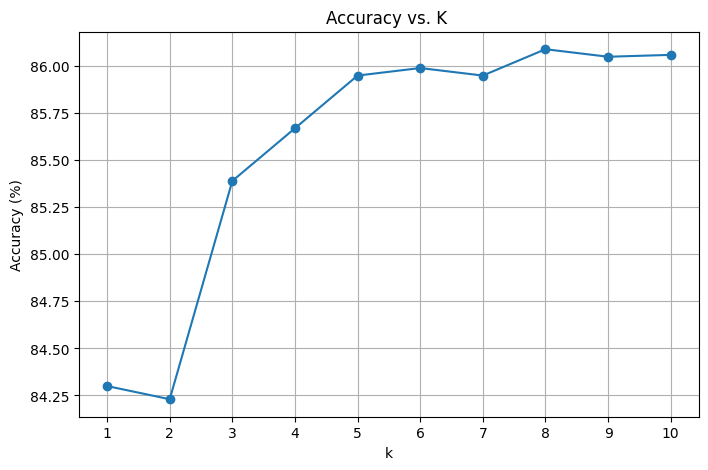

# MNIST Classification using K-Nearest Neighbors (KNN)

This project performs Fashion classification on the MNIST dataset using the **K-Nearest Neighbors (KNN)** algorithm. 

To enhance efficiency and accuracy, **Principal Component Analysis (PCA)** is applied for dimensionality reduction before the KNN algorithm is used. All the operations including PCA and KNN have been implemented **from scratch** — no inbuilt machine learning libraries are used.

## Input
- All the images are flattened and then stored in the .csv file
- There are two files one is train.csv and another is test.csv
  
---

## 📌 Features

- Handwritten fashion classification on MNIST dataset
- PCA implementation for dimensionality reduction
- KNN implementation from scratch (no libraries like scikit-learn used)
- Evaluation of model performance for different values of `k`
- Achieved **highest accuracy of 86.09%** at `k = 8`

---

## 📊 Result

Final classification accuracy plot:

---

## 🛠️ Technologies Used

- Python (Google Colab)
- NumPy
- Matplotlib (for plotting)

---
